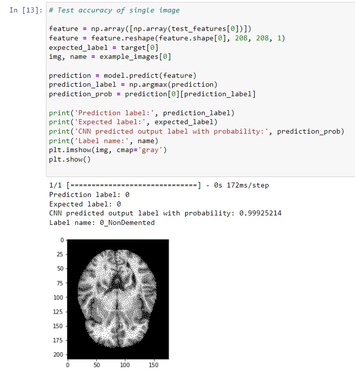

# Convolutional Neural Network (CNN) -- Alzheimer's Disease (AD)

# Description
- Jupter Notebook script that classify's over 5000 images of AD patients brain scans using CNN.
- See full script in [Jupyter Notebook](https://github.com/ericvpineda/cnn_ad/blob/master/ad_mri_classification.ipynb)

# Resources 
- Dataset: [Kaggle](https://www.kaggle.com/datasets/tourist55/alzheimers-dataset-4-class-of-images?resource=download)

# FAQ
- Virtualenv not working in .ipynb: [StackOverflow](https://stackoverflow.com/questions/42449814/running-jupyter-notebook-in-a-virtualenv-installed-sklearn-module-not-available)
